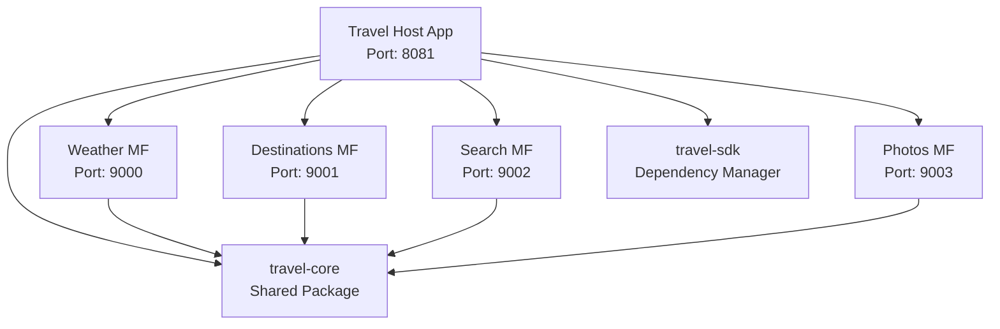

# 🌍 Travel App - Module Federation V2 Super App Architecture

> A comprehensive React Native super app demonstrating **Module Federation V2** with **Re.Pack
> 5.x**, showcasing micro-frontend architecture patterns and advanced bundle management.

## 📋 Table of Contents

- [Architecture Overview](#-architecture-overview)
- [Key Learnings](#-key-learnings)
- [Dependencies & Tooling](#-dependencies--tooling)
- [Project Structure](#-project-structure)
- [Setup & Installation](#-setup--installation)
- [Development Workflow](#-development-workflow)
- [Configuration Deep Dive](#-configuration-deep-dive)
- [Troubleshooting](#-troubleshooting)
- [Performance Optimization](#-performance-optimization)

---

## 🏗️ Architecture Overview

This project demonstrates a **Module Federation V2** super app architecture with the following
micro-frontends:



### Key Benefits Achieved

- ✅ **Manifest-Based Resolution**: Automatic remote discovery via JSON manifests
- ✅ **Platform Agnostic**: Dynamic `${platform}` interpolation for iOS/Android
- ✅ **Zero Configuration**: No custom resolvers or URL management needed
- ✅ **Version Management**: Built-in caching and dependency sharing
- ✅ **Developer Experience**: Hot reloading across micro-frontends
- ✅ **Type Safety**: Enhanced TypeScript integration

---

## 🎓 Key Learnings

### 1. **The Manifest Magic**

MF V2's manifest system (`mf-manifest.json`) provides:

- Automatic remote discovery
- Platform-specific resolution (`${platform}` interpolation)
- Built-in version management
- Zero configuration complexity

```javascript
// Simple, declarative configuration
remotes: {
  TravelWeather: `TravelWeather@http://localhost:9000/${platform}/mf-manifest.json`,
  TravelDestinations: `TravelDestinations@http://localhost:9001/${platform}/mf-manifest.json`
}
```

### 2. **Re.Pack 5.x + Rspack = Performance**

The combination delivers:

- **Fast builds** with Rspack's Rust-based bundling
- **Hot reloading** across micro-frontends
- **Tree shaking** for optimal bundle sizes
- **Hermes bytecode** support for production

### 3. **ModuleFederationPluginV2 Features**

The enhanced plugin provides:

- **Manifest-based resolution**: No manual URL management
- **Dynamic type hinting**: Better TypeScript integration
- **Runtime plugin system**: Extensible architecture
- **Built-in optimization**: Automatic dependency sharing

---

## 🛠️ Dependencies & Tooling

### Essential Dependencies

| Package                       | Version   | Purpose                                      |
| ----------------------------- | --------- | -------------------------------------------- |
| `@callstack/repack`           | `5.2.0`   | React Native bundling with Module Federation |
| `@module-federation/enhanced` | `0.13.1`  | Enhanced MF features                         |
| `@rspack/core`                | `^1.4.0`  | Fast Rust-based bundler                      |
| `@swc/helpers`                | `0.5.15`  | SWC transformation helpers                   |

### Workspace Management

| Tool       | Purpose                                 | Configuration         |
| ---------- | --------------------------------------- | --------------------- |
| **pnpm**   | Package manager with workspace support  | `pnpm-workspace.yaml` |
| **nx**     | Monorepo tooling and task orchestration | `nx.json`             |
| **mprocs** | Multi-process development server        | `mprocs.yaml`         |

### React Native Stack

- **React Native**: `0.80.2`
- **React**: `19.1.0`
- **Expo**: `~53.0.22`
- **Node.js**: `>=22` (engineStrict)

---

## 📁 Project Structure

```
travel-app-repack-example/
├── 📱 apps/                          # Micro-frontend applications
│   ├── travel-host/                  # Main host app (Port: 8081)
│   │   ├── rspack.config.mjs         # MF V2 host (runtime remotes)
│   │   └── src/federation/           # Dynamic remote registration
│   ├── travel-weather/               # Weather MF (Port: 9000)
│   ├── travel-destinations/          # Destinations MF (Port: 9001)
│   ├── travel-search/               # Search MF (Port: 9002)
│   └── travel-photos/               # Photos MF (Port: 9003)
├── 📦 packages/                      # Shared packages
│   ├── travel-core/                  # Core utilities & components
│   │   ├── src/components/           # Shared UI components
│   │   ├── src/context/             # Global state management
│   │   └── src/utils/               # Utility functions
│   └── travel-sdk/                   # Dependency management SDK
│       ├── lib/dependencies.json    # Centralized dependency versions
│       └── lib/sharedDeps.js        # MF shared dependencies factory
├── remotes-dist/                    # Pre-built remote bundles + registry
├── scripts/                         # build-remotes, serve-remotes
├── ⚙️ Configuration Files
│   ├── nx.json                      # Nx workspace configuration
│   ├── mprocs.yaml                  # Multi-process dev setup
│   ├── pnpm-workspace.yaml          # PNPM workspace definition
│   └── tsconfig.json                # Root TypeScript config
└── 📚 docs/                         # Documentation
```

---

## 🚀 Setup & Installation

### Prerequisites

```bash
# Required versions
node --version    # >= 22.0.0
pnpm --version    # >= 10.10.0
```

### Installation Steps

```bash
# 1. Clone and install dependencies
git clone <repository-url>
cd travel-app-repack-example
pnpm install

# CI uses frozen lockfile: pnpm install:ci
# Supply-chain hardening: see docs/SECURITY-PNPM.md

# 2. iOS setup (if developing for iOS)
cd apps/travel-host/ios
pod install
cd ../../..

# 3. Start all micro-frontends
pnpm start  # Uses mprocs for orchestration

# Alternative: Start individually
pnpm start:travel-host        # Host app
pnpm start:travel-weather     # Weather MF
pnpm start:travel-destinations # Destinations MF
pnpm start:travel-search      # Search MF
pnpm start:travel-photos      # Photos MF
```

### Running on Device

```bash
# iOS
pnpm run:travel-host:ios

# Android
pnpm run:travel-host:android
```

---

## 🔧 Development Workflow

### 1. **Multi-Process Development** (Recommended)

```bash
# Start all services with mprocs
pnpm start
```

This launches:

- Host app on port 8081
- Weather MF on port 9000
- Destinations MF on port 9001
- Search MF on port 9002
- Photos MF on port 9003

### 2. **Individual Development**

```bash
# Terminal 1: Host
pnpm start:travel-host

# Terminal 2: Specific micro-frontend
pnpm start:travel-weather
```

### 3. **Dev vs Prod (no `REMOTE_PROFILE` env var)**

Profile is derived automatically:

| Mode | Runtime | MF URLs | Registry |
|------|---------|---------|----------|
| **dev** | `__DEV__` | Live bundlers `:9000-9003` (build-time rspack) | In-memory from catalog |
| **prod** | release build | CDN / `:4100` fallback | `fetch(remote-registry.json)` + `registerRemotes()` |

Dev MF URLs use `localhost` (simulator). Prod registry URL: `app.config.ts` → `extra.remoteRegistryUrl`.

```bash
# Dev (default debug build)
pnpm start

# Prod-like local test (release build + static bundles)
pnpm build:remotes:ios
pnpm serve:remotes       # :4100
pnpm run:travel-host:ios --configuration Release
```

### 4. **Standalone Mode**

Each micro-frontend can run independently:

```bash
pnpm start:standalone:travel-weather
```

---

## ⚙️ Configuration Deep Dive

### 1. **Module Federation V2 Host Configuration**

```javascript
// apps/travel-host/rspack.config.mjs — remotes registered at runtime
new Repack.plugins.ModuleFederationPluginV2({
  name: 'TravelHost',
  dts: false,
  remotes: {},
  shared: getSharedDependencies({ eager: true }),
  runtimePlugins: ['./fetch-with-policy-plugin.ts'],
});

// apps/travel-host/src/federation/initRemotes.ts
registerRemotes(registry.remotes); // from remote-registry.json or dev config
```

### 2. **Module Federation V2 Remote Configuration**

```javascript
// apps/travel-weather/rspack.config.mjs
new Repack.plugins.ModuleFederationPluginV2({
  name: 'TravelWeather',
  filename: 'TravelWeather.container.js.bundle',
  dts: false,
  exposes: {
    './WeatherScreen': './src/WeatherScreen',
  },
  shared: getSharedDependencies({ eager: false }),
});
```

### 3. **RNEF Configuration**

```javascript
// rnef.config.mjs
export default {
  bundler: pluginRepack(),
  platforms: {
    ios: platformIOS(),
    android: platformAndroid(),
  },
  remoteCacheProvider: null,
};
```

### 4. **Shared Dependencies Management**

```javascript
// packages/travel-sdk/lib/sharedDeps.js
const getSharedDependencies = ({ eager = true }) => {
  const dependencies = require('./dependencies.json');

  const shared = Object.entries(dependencies).map(([dep, { version }]) => {
    return [dep, { singleton: true, eager, requiredVersion: version, version }];
  });

  return Object.fromEntries(shared);
};
```

### 5. **Nx Workspace Configuration**

```json
// nx.json
{
  "workspaceLayout": {
    "appsDir": "apps",
    "libsDir": "packages"
  },
  "targetDefaults": {
    "bundle:ios": { "outputs": ["{projectRoot}/build"], "cache": true },
    "bundle:android": { "outputs": ["{projectRoot}/build"], "cache": true }
  }
}
```

### 6. **Multi-Process Development Setup**

```yaml
# mprocs.yaml
procs:
  Host:
    shell: pnpm start:travel-host
    stop: SIGKILL
  Weather:
    shell: pnpm start:travel-weather
    stop: SIGKILL
  # ... other micro-frontends
```

---

## 🐛 Troubleshooting

### Common Issues & Solutions

#### 1. **Manifest Loading Issues**

**Issue**: Remote manifests fail to load

**Debug Steps**:

```bash
# Check if manifest is accessible
curl http://localhost:9000/android/mf-manifest.json

# Verify manifest structure
cat apps/travel-weather/dist/android/mf-manifest.json
```

**Solution**: Ensure remote is running and ports are correct

#### 2. **Port Conflicts**

**Issue**: Multiple services trying to use the same port

**Solution**: Check port allocation in package.json scripts:

- Host: 8081
- Weather: 9000
- Destinations: 9001
- Search: 9002
- Photos: 9003

#### 3. **Platform Resolution Issues**

**Issue**: Incorrect platform detection in manifest URLs

**Solution**: Verify platform interpolation:

```javascript
// Ensure ${platform} resolves correctly
remotes: {
  TravelWeather: `TravelWeather@http://localhost:9000/${platform}/mf-manifest.json`;
}
```

#### 4. **Shared Dependency Mismatches**

**Issue**: Version conflicts between host and remotes

**Solution**: Use centralized dependency management:

```json
// packages/travel-sdk/lib/dependencies.json
{
  "react": { "version": "19.0.0" },
  "react-native": { "version": "0.79.5" }
}
```

#### 5. **Bundle Loading Failures**

**Issue**: Remote bundles fail to load

**Debug Steps**:

```bash
# Check manifest accessibility
curl http://localhost:9000/android/mf-manifest.json

# Monitor network requests
adb logcat | grep -i "module federation"

# Enable MF debugging
console.log('MF V2 Debug:', window.__FEDERATION__);
```

---

## ⚡ Performance Optimization

### 1. **Bundle Optimization**

```javascript
// Enable Hermes bytecode for production
new Repack.plugins.HermesBytecodePlugin({
  enabled: mode === 'production',
  test: /\.(js)?bundle$/,
  exclude: /index.bundle$/,
});
```

### 2. **Shared Dependencies Strategy**

```javascript
// Host: Eager loading for core dependencies
shared: getSharedDependencies({ eager: true });

// Remotes: Lazy loading for optimal startup
shared: getSharedDependencies({ eager: false });
```

### 3. **Build Caching**

```json
// nx.json - Enable build caching
"targetDefaults": {
  "bundle:ios": { "cache": true },
  "bundle:android": { "cache": true }
}
```

---

## 🎯 Best Practices

### 1. **Dependency Management**

- Centralize shared dependencies in `travel-sdk`
- Use exact versions for consistency
- Regular dependency audits

### 2. **Development Workflow**

- Use `mprocs` for orchestrated development
- Enable hot reloading for fast iterations
- Implement proper error boundaries

### 3. **Code Organization**

- Keep micro-frontends loosely coupled
- Share common UI through `travel-core`
- Use TypeScript for type safety

### 4. **Performance**

- Lazy load non-critical micro-frontends
- Optimize bundle sizes with tree shaking
- Use Hermes for production builds

---

## 📚 Additional Resources

- [Module Federation V2 Documentation](https://module-federation.io/guide/start/index.html)
- [Re.Pack Documentation](https://re-pack.dev/)
- [React Native New Architecture](https://reactnative.dev/docs/the-new-architecture/landing-page)
- [Nx Monorepo Guide](https://nx.dev/getting-started/intro)

---

## 🤝 Contributing

1. Fork the repository
2. Create a feature branch
3. Make your changes
4. Add tests if applicable
5. Submit a pull request

---

## 📄 License

This project is licensed under the MIT License - see the [LICENSE](LICENSE) file for details.

---

**Built with ❤️ using Module Federation V2, Re.Pack 5.x, and React Native 0.79.5**
