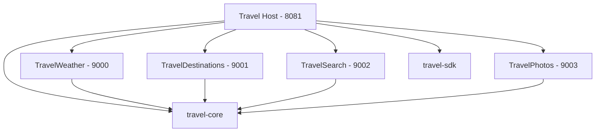
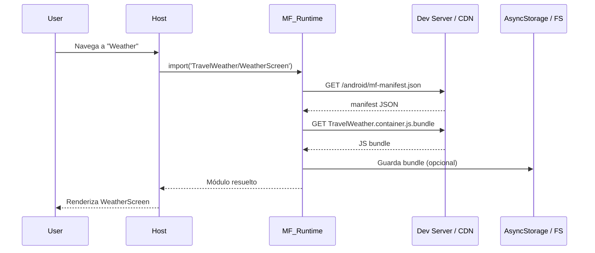

# Guía de estudio: Micro-apps con React Native

> Guía teórica y práctica para implementar micro-apps (micro-frontends) en React Native usando **Re.Pack 5** y **Module Federation V2**, basada en la arquitectura de este repositorio (`travel-repack-super-app`).

## Tabla de contenidos

- [Parte 1 — Fundamentos](#parte-1--fundamentos)
- [Parte 2 — Teoría: descarga remota](#parte-2--teoría-cómo-se-descarga-un-remote-remotamente)
- [Parte 3 — Conceptos intermedios](#parte-3--conceptos-intermedios-configuración-práctica)
- [Parte 4 — Conceptos avanzados](#parte-4--conceptos-avanzados)
- [Parte 5 — Estrategias de descarga remota](#parte-5--estrategias-de-descarga-remota)
- [Parte 6 — Mapa de estudio](#parte-6--mapa-de-estudio-recomendado)
- [Parte 7 — Errores comunes](#parte-7--errores-comunes-y-cómo-diagnosticarlos)
- [Parte 8 — Decisiones arquitectónicas](#parte-8--decisiones-arquitectónicas-clave)
- [Recursos](#recursos-para-profundizar)

---

## Parte 1 — Fundamentos

### 1.1 ¿Qué es una micro-app en React Native?

Una **micro-app** (o micro-frontend móvil) es un **módulo de UI y lógica empaquetado por separado** que la app principal (**host**) puede cargar **en runtime**, sin recompilar ni publicar una nueva versión completa en la store.

```
┌─────────────────────────────────────┐
│           HOST (Super App)          │
│  Shell, navegación, auth, SDK       │
│                                     │
│  ┌─────────┐ ┌─────────┐ ┌───────┐ │
│  │ Weather │ │ Search  │ │Photos │ │  ← Remotes (micro-apps)
│  └─────────┘ └─────────┘ └───────┘ │
└─────────────────────────────────────┘
```

#### Beneficios

- Despliegues independientes por equipo o feature
- Reducción del bundle inicial del host
- Aislamiento de fallos (una micro-app caída no tumba toda la app)
- Experimentación A/B por módulo

#### Costos

- Complejidad de versionado y compatibilidad
- Gestión de dependencias compartidas (`react`, `react-native`, navegación…)
- Debugging más difícil (múltiples bundlers, puertos, caché)
- Latencia en la primera carga del remote

### 1.2 Arquitectura de este proyecto



| App | Rol | Puerto | Expone |
|-----|-----|--------|--------|
| `travel-host` | Host (super app) | 8081 | Consume remotes |
| `travel-weather` | Remote MF | 9000 | `./WeatherScreen` |
| `travel-destinations` | Remote MF | 9001 | `./DestinationsScreen` |
| `travel-search` | Remote MF | 9002 | `./SearchScreen` |
| `travel-photos` | Remote MF | 9003 | `./PhotosScreen` |

### 1.3 Vocabulario esencial

| Concepto | Definición |
|----------|------------|
| **Host** | App contenedora que orquesta navegación y carga remotes |
| **Remote** | Micro-app que expone módulos al host |
| **Container** | Bundle principal del remote (`TravelWeather.container.js.bundle`) |
| **Expose** | Qué exporta el remote (`./WeatherScreen`) |
| **Shared** | Dependencias compartidas entre host y remotes |
| **Manifest** | JSON que describe qué bundles existen y dónde están |
| **Singleton** | Una sola instancia de una lib compartida (ej. `react`) |
| **Eager / Lazy** | Cargar shared deps al inicio vs. bajo demanda |

### 1.4 Comparación con otras estrategias

| Estrategia | Cómo funciona | Cuándo usarla |
|------------|---------------|---------------|
| **Monolito** | Todo en un bundle | Apps pequeñas, equipos pequeños |
| **Code splitting local** | Chunks dentro del mismo bundle | Optimizar tamaño sin despliegue independiente |
| **Module Federation** | Bundles separados, resolución en runtime | Equipos paralelos, features modulares |
| **OTA (CodePush / Expo Updates)** | Actualiza JS del monolito | Hotfixes rápidos, no arquitectura modular |
| **WebView / Mini-program** | Contenido en WebView nativo | Contenido web, bajo acoplamiento RN |
| **Native modules separados** | Código nativo por feature | Lógica nativa pesada, no UI React |

**Module Federation en RN** es la opción más cercana a lo que hacen las super apps (WeChat, Alipay) pero manteniendo componentes React Native nativos.

### 1.5 Stack tecnológico de referencia

| Tecnología | Versión (proyecto) | Rol |
|------------|-------------------|-----|
| React Native | 0.80.2 | Framework móvil |
| React | 19.1.0 | UI library |
| Re.Pack | 5.2.0 | Bundler con MF para RN |
| Rspack | ^1.4.0 | Motor de bundling (Rust) |
| Module Federation | 0.13.1 | Runtime de federación |
| Expo | ~53 | Tooling nativo (host) |
| pnpm + Nx | — | Monorepo y orquestación |

---

## Parte 2 — Teoría: cómo se descarga un remote remotamente

### 2.1 Flujo completo



### 2.2 Fases de la descarga

#### Fase 1 — Resolución del remote

El host declara remotes en build time vía `createHostRspackConfig()` → `buildHostRemotes(profile, platform)` (`packages/travel-sdk/lib/remoteProfiles.mjs`):

```javascript
// Perfil dev → :9000-9003 | static/external → localhost:4100 (constante en remoteDefaults)
remotes: buildHostRemotes(undefined, platform),
// Ejemplo static/ios:
// TravelWeather@http://localhost:4100/weather/ios/mf-manifest.json
```

`${platform}` se resuelve a `ios` o `android` en build time del host. La URL base depende de `REMOTE_PROFILE` en `.env` (cargado por `rspack.config.mjs` + `dotenv`).

#### Fase 2 — Fetch del manifest

El runtime de Module Federation solicita `mf-manifest.json`. Ese archivo describe:

- Nombre del remote
- URL del container bundle
- Chunks adicionales
- Versiones y shared dependencies

#### Fase 3 — Descarga del container

Re.Pack usa `ScriptManager` para descargar el `.js.bundle` (o bytecode Hermes en producción).

#### Fase 4 — Resolución de shared deps

Si el remote necesita `react`, el runtime verifica si el host ya lo cargó como `singleton`. Si hay conflicto de versión → error o fallback.

#### Fase 5 — Ejecución del módulo expuesto

El `import('TravelWeather/WeatherScreen')` devuelve el componente exportado por el remote.

### 2.3 ¿Qué transporta la red?

**Desarrollo:**

```
http://localhost:9000/android/mf-manifest.json
http://localhost:9000/android/TravelWeather.container.js.bundle
```

**Producción típica:**

```
https://cdn.tuempresa.com/mf/weather/v1.2.0/android/mf-manifest.json
https://cdn.tuempresa.com/mf/weather/v1.2.0/android/TravelWeather.container.js.bundle
```

> **Importante:** En dispositivo físico, `localhost` no funciona. Usa `HOST_IP_ADDRESS` en `.env`.

### 2.4 Caché: dónde vive el bundle descargado

Este proyecto implementa **dos capas de caché**:

1. **ScriptManager (Re.Pack)** — caché de scripts en filesystem/memoria
2. **BundleCacheManager (travel-core)** — versionado con AsyncStorage

```typescript
// Clave versionada
bundle_TravelWeather_android_1.0.0
```

| Estrategia | Pros | Contras |
|------------|------|---------|
| **Sin caché** | Siempre última versión | Lento, consume datos |
| **Caché por versión** | Controlado, invalidación clara | Requiere versionado explícito |
| **Caché + TTL** | Balance UX/actualización | Puede servir versión vieja temporalmente |
| **Stale-while-revalidate** | UX rápida + update en background | Más complejo |

---

## Parte 3 — Conceptos intermedios (configuración práctica)

### 3.1 Shared dependencies

Centralizadas en `packages/travel-sdk/lib/dependencies.json`:

```json
{
  "react": { "version": "19.1.0" },
  "react-native": { "version": "0.80.2" },
  "@react-navigation/native": { "version": "^7.1.17" },
  "travel-core": { "version": "0.0.1" }
}
```

Expuestas vía `packages/travel-sdk/lib/sharedDeps.js`:

```javascript
const getSharedDependencies = ({ eager = true }) => {
  const dependencies = require('./dependencies.json');

  const shared = Object.entries(dependencies).map(([dep, { version }]) => {
    return [dep, { singleton: true, eager, requiredVersion: version, version }];
  });

  return Object.fromEntries(shared);
};
```

#### Reglas de oro

- `react` y `react-native` **siempre singleton**
- Host: `eager: true` (carga al inicio)
- Remotes: `eager: false` (usa lo que ya cargó el host)
- **Misma versión exacta** en host y todos los remotes

> **Error típico:** Remote compilado con RN 0.79 y host con 0.80 → crash silencioso o hooks rotos.

### 3.2 Eager vs Lazy en shared deps

```
HOST (eager: true)
├── react ✓ cargado al inicio
├── react-native ✓
└── @react-navigation/native ✓

REMOTE (eager: false)
├── react → usa instancia del host
├── react-native → usa instancia del host
└── travel-core → resuelve desde host si está shared
```

### 3.3 Exposes: qué puede importar el host

Cada remote define qué expone en su `rspack.config.mjs`:

```javascript
// apps/travel-weather/rspack.config.mjs
exposes: {
  './WeatherScreen': './src/WeatherScreen',
}
```

El host consume:

```typescript
await import('TravelWeather/WeatherScreen');
```

#### Buenas prácticas de exposes

- Exponer **pantallas o features**, no utilidades internas
- Un export default por pantalla
- Evitar exponer stores o contextos internos del remote

### 3.4 Carga lazy en React

Patrón usado en `apps/travel-host/src/screens/LazyWeatherScreen.tsx`:

```typescript
const WeatherScreen = React.lazy(async () => {
  try {
    const module = await import('TravelWeather/WeatherScreen');
    if (!module?.default) throw new Error('Module not found');
    return module;
  } catch (error) {
    return { default: WeatherFallback };
  }
});

<ErrorBoundary fallback={<FederationErrorFallback />}>
  <Suspense fallback={<Loading />}>
    <WeatherScreen />
  </Suspense>
</ErrorBoundary>
```

#### Capas de resiliencia

1. `try/catch` en el import → fallback UI si el remote no está corriendo
2. `Suspense` → loading mientras descarga
3. `ErrorBoundary` → errores de render en el remote

### 3.5 Desarrollo local: orquestación multi-proceso

`mprocs.yaml` levanta 5 procesos:

| Proceso | Puerto | Comando |
|---------|--------|---------|
| Host | 8081 | `pnpm start:travel-host` |
| Weather | 9000 | `pnpm start:travel-weather` |
| Destinations | 9001 | `pnpm start:travel-destinations` |
| Search | 9002 | `pnpm start:travel-search` |
| Photos | 9003 | `pnpm start:travel-photos` |

```bash
# Iniciar todo
pnpm start

# O individualmente
pnpm start:travel-host
pnpm start:travel-weather
```

**Sin todos los remotes corriendo**, el host muestra fallback amigable (no crash).

#### Android físico — port forwarding

```bash
adb reverse tcp:8081 tcp:8081
adb reverse tcp:9000 tcp:9000
adb reverse tcp:9001 tcp:9001
adb reverse tcp:9002 tcp:9002
adb reverse tcp:9003 tcp:9003
```

#### Dispositivo en red local

```bash
# .env
HOST_IP_ADDRESS=192.168.1.100
```

---

## Parte 4 — Conceptos avanzados

### 4.1 Versionado y despliegue independiente

**Modelo recomendado en producción:**

```
CDN/
├── weather/
│   ├── 1.0.0/android/mf-manifest.json
│   ├── 1.1.0/android/mf-manifest.json
│   └── latest → symlink a 1.1.0
├── search/
│   └── ...
```

**Flujo de actualización (POC actual):**

1. CI/CD publica bundles nuevos al CDN y actualiza `remote-registry.json` con `"version": "1.1.0"`
2. Al arrancar el host: `loadRemoteRegistry()` → `loadRemoteConfig()` lee `remote.version` del registry
3. `BundleCacheManager.checkForUpdates()` compara con AsyncStorage e invalida caché vieja
4. Al abrir la micro-app: `import()` descarga manifest + container + chunk si no hay cache para la versión nueva

```typescript
// bundleVersioning.ts — config activa en runtime (no constante estática)
const config = await loadRemoteConfig();
// → { TravelWeather: { version: '1.1.0', url, manifestUrl }, ... }
```

**Importante:** la versión no se infiere del bundle; hay que subirla en `packages/travel-sdk/lib/remotesCatalog.json` (y regenerar `remote-registry.json` con `pnpm generate:registry` o el script equivalente). Sin bump de versión, el host puede reutilizar caché aunque el archivo en CDN cambió. `checkForUpdates()` solo corre **al abrir la app**, no en background.

### 4.2 Runtime plugins (fetch y reintentos)

`apps/travel-host/fetch-with-policy-plugin.ts` intercepta **todos** los fetch de MF (manifest, container, chunks):

| Comportamiento actual (POC) | Futuro (prod) |
|-----------------------------|---------------|
| Log de URL y tipo (manifest/container/asset) | Bearer token por dominio |
| Reintentos con backoff (3 intentos) | Caché de manifest offline |
| Pass-through sin auth | Verificación de firma SHA-256 |

Además, `setupTravelScriptResolver()` añade `retry: 3` a descargas vía `ScriptManager`, y `createLazyFederatedScreen` ofrece botón **Retry download** que llama a `BundleCacheManager.invalidateRemote()`.

### 4.3 Hermes bytecode en producción

Los remotes activan en producción:

```javascript
new Repack.plugins.HermesBytecodePlugin({
  enabled: mode === 'production',
  test: /\.(js)?bundle$/,
  exclude: /index.bundle$/,
});
```

**Bytecode** = bundle precompilado para Hermes → arranque más rápido del remote.

> Host y remotes deben compilarse con la **misma versión de Hermes**.

### 4.4 Compatibilidad de contratos entre host y remotes

Define contratos en `packages/travel-core/src/types.ts`:

```typescript
export interface Destination { /* ... */ }
export interface FlightResult { /* ... */ }
export interface HotelResult { /* ... */ }
export interface Weather { /* ... */ }
```

| Estrategia | Descripción |
|------------|-------------|
| Tipos en `travel-core` | Enfoque actual del proyecto |
| `dts: true` en MF | Generación automática de tipos |
| Contract tests | Tests de integración entre equipos |

### 4.5 Aislamiento de estado

| Enfoque | Descripción |
|---------|-------------|
| Estado en el host | Remotes reciben props/callbacks |
| Estado local por remote | Cada MF maneja su store interno |
| `travel-core` como bus | Contextos compartidos explícitos (`TravelProvider`, `ThemeProvider`) |
| Event bus | Comunicación desacoplada (EventEmitter, deep links internos) |

### 4.6 Navegación entre micro-apps

| Opción | Descripción | Complejidad |
|--------|-------------|-------------|
| **A — Host controla navegación** | Stack en host, screens lazy (proyecto actual) | Baja |
| **B — Navegación federada** | Cada remote expone su navigator | Alta |
| **C — Deep links internos** | `travel://weather?city=paris` | Media |

Para la mayoría de casos, **Opción A** es la más mantenible.

### 4.7 Seguridad de bundles remotos

Checklist para producción:

- [ ] HTTPS obligatorio
- [ ] Firma/hash del bundle (SHA-256 en manifest)
- [ ] Token de acceso al CDN
- [ ] Certificate pinning (opcional)
- [ ] Validación de versión mínima del host
- [ ] Rollback automático si el remote falla al cargar
- [ ] Monitoreo de errores de federation (Sentry, etc.)

---

## Parte 5 — Estrategias de descarga remota

### 5.1 On-demand (lazy load)

```
Usuario abre feature → descarga → renderiza
```

- **Cuándo:** features poco usadas, muchos remotes
- **Implementación:** `createLazyFederatedScreen()` → `import('TravelWeather/WeatherScreen')` con fallback + retry manual

### 5.2 Preload al inicio

```typescript
// useRemoteBootstrap — solo en perfiles static/external (no en dev)
BundleCacheManager.preloadBundles(['TravelWeather', 'TravelSearch'], platform, config);
```

- **Cuándo:** bundles precompilados en CDN (`static` / `external`)
- **No en dev:** el prefetch por container directo falla si los bundlers `:9000` no están levantados; en dev la carga ocurre al navegar vía MF

### 5.3 Preload predictivo

```
Usuario en Home → prefetch Weather y Search en background
Usuario en Destinations → prefetch Photos
```

Basado en analytics de navegación del usuario.

### 5.4 Bundle embebido + update remoto

```
v1: bundle incluido en el APK (offline-first)
v2+: actualización desde CDN si hay red
```

Ideal para mercados con conectividad limitada.

### 5.5 Canary / rollout gradual

```
10% usuarios → weather v1.1.0
90% usuarios → weather v1.0.0
```

El host lee config del backend con versión por segmento de usuario.

### 5.6 Comparativa de estrategias

| Estrategia | Tiempo 1ª carga | Uso de red | Complejidad | Offline |
|------------|-----------------|------------|-------------|---------|
| On-demand | Alto | Bajo (solo lo usado) | Baja | No |
| Preload inicio | Medio | Alto | Media | Parcial |
| Preload predictivo | Bajo | Medio | Alta | Parcial |
| Embebido + update | Muy bajo | Bajo | Alta | Sí |
| Canary | Variable | Variable | Muy alta | Depende |

---

## Parte 6 — Mapa de estudio recomendado

### Semana 1 — Fundamentos

- [ ] Entender host vs remote vs shared deps
- [ ] Correr `pnpm start` y observar los 5 procesos
- [ ] Abrir cada feature y ver la descarga en logs
- [ ] Apagar un remote y verificar el fallback UI
- [ ] Leer `README.md` y esta guía completa

### Semana 2 — Configuración

- [ ] Estudiar `apps/travel-host/rspack.config.mjs`
- [ ] Estudiar `apps/travel-weather/rspack.config.mjs`
- [ ] Modificar un `expose` y consumirlo desde el host
- [ ] Cambiar una versión en `dependencies.json` y observar el efecto
- [ ] Probar en dispositivo físico con `HOST_IP_ADDRESS`

### Semana 3 — Runtime y caché

- [ ] Estudiar `BundleCacheManager` en `travel-core`
- [ ] Estudiar `bundleVersioning.ts`
- [ ] Usar `BundleCacheDebugScreen` para invalidar caché
- [ ] Leer `fetch-with-policy-plugin.ts`
- [ ] Simular cambio de versión y verificar invalidación

### Semana 4 — Producción

- [ ] Build de producción con Hermes bytecode
- [ ] Diseñar estructura CDN con versionado
- [ ] Implementar config remota de versiones
- [ ] Definir contratos TypeScript en `travel-core`
- [ ] Plan de rollback y monitoreo de errores

### Ejercicios prácticos sugeridos

1. **Crear un 5º remote** (`travel-profile`) con su pantalla y navegación en el host
2. **Implementar preload** de Weather al abrir Home
3. **Simular deploy** cambiando `version` en `remote-registry.json`, rebuild de remotes, y verificando invalidación en `BundleCacheDebugScreen`
4. **Agregar auth** al fetch del manifest en modo dev
5. **Medir tiempo de carga** del remote con y sin caché

---

## Parte 7 — Errores comunes y cómo diagnosticarlos

| Error | Causa probable | Solución |
|-------|---------------|----------|
| `Failed to load remote entry` | Remote no corriendo o puerto incorrecto | `pnpm start:travel-weather` |
| `remoteEntryExports is undefined` | Manifest incorrecto o versión MF incompatible | Verificar `mf-manifest.json` |
| `Singleton version mismatch` | Versiones distintas de `react`/`react-native` | Alinear `dependencies.json` |
| Pantalla en blanco en dispositivo | `localhost` en lugar de IP real | `HOST_IP_ADDRESS=192.168.x.x` |
| Hooks error / invalid hook call | Dos instancias de React | Verificar `singleton: true` |
| Bundle viejo después de deploy | Versión no actualizada en registry o caché | Bump `version` en registry + reiniciar app |
| `ScriptDownloadFailure` en boot (dev) | Prefetch con bundlers apagados | Normal en dev; usar `static` o levantar remotes |
| Log `(dev)` pero pantallas van a `:4100` | `REMOTE_PROFILE` desincronizado | Unificar `.env` + rebuild nativo (`expo run:ios`) |
| `babel-plugin-transform-remove-console` | Falta en remotes al build producción | `pnpm add -D babel-plugin-transform-remove-console --filter TravelWeather` |
| Puerto en uso | Otro proceso ocupa el puerto | `lsof -i :9000` y matar proceso |

### Comandos de diagnóstico

```bash
# Verificar manifest accesible
curl http://localhost:9000/android/mf-manifest.json

# Ver estructura del manifest
cat apps/travel-weather/dist/android/mf-manifest.json

# Logs Android — Module Federation
adb logcat | grep -i "module federation\|ScriptManager\|Federation"

# Verificar puertos en uso
lsof -i :8081 -i :9000 -i :9001 -i :9002 -i :9003

# Port forwarding Android
pnpm adbreverse
```

### Debug del runtime MF

```javascript
// En consola del dispositivo (dev)
console.log('MF Debug:', global.__FEDERATION__);
```

---

## Parte 8 — Decisiones arquitectónicas clave

Antes de implementar micro-apps en producción, responde:

| Pregunta | Si NO → reconsidera MF |
|----------|------------------------|
| ¿Cuántos equipos/features independientes tienes? | 1 equipo → monolito puede bastar |
| ¿Con qué frecuencia actualizas cada feature por separado? | Todo junto → OTA puede ser suficiente |
| ¿Puedes garantizar versiones alineadas de RN? | Sin alineación → MF será frágil |
| ¿Tienes CDN/infra para servir bundles? | Sin CDN → solo funciona en dev |
| ¿Qué pasa si un remote falla? | Sin fallback → mala UX |

### Cuándo SÍ usar micro-apps

- Múltiples equipos con ciclos de release independientes
- Features grandes que no todos los usuarios necesitan
- Necesidad de actualizar módulos sin pasar por review de store
- Super app con dominios de negocio separados

### Cuándo NO usar micro-apps

- Equipo pequeño (< 5 devs)
- App con pocas pantallas
- Sin infraestructura de CDN/deploy por módulo
- Primera versión del producto (MVP)

---

## Resumen por nivel

| Nivel | Qué dominar |
|-------|-------------|
| **Básico** | Host/remote, exposes, shared deps, lazy import, puertos |
| **Intermedio** | Manifest, eager/lazy, ErrorBoundary, dev workflow, `travel-sdk` |
| **Avanzado** | Versionado, caché, runtime plugins, Hermes, CDN, auth, rollout |

---

## Archivos clave del proyecto

| Archivo | Qué aprender |
|---------|-------------|
| `packages/travel-sdk/lib/createRspackConfig.mjs` | Factory rspack host/remotes + `buildHostRemotes` |
| `packages/travel-sdk/lib/remotesCatalog.json` | Catálogo único: slug, devPort, version por remote |
| `packages/travel-sdk/lib/remoteProfiles.mjs` | Perfiles dev/static/external y registry JSON |
| `apps/travel-host/app.config.ts` | Config Expo (prebuild); `.env` para runtime |
| `apps/travel-host/rspack.config.mjs` | Entry host + `dotenv` + plugins MF |
| `apps/travel-host/src/federation/createLazyFederatedScreen.tsx` | Carga lazy + fallback + retry |
| `apps/travel-host/src/federation/initRemotes.ts` | `registerRemotes` solo en `external` |
| `packages/travel-core/src/utils/remoteRegistry.ts` | Catálogo de remotes por perfil |
| `packages/travel-core/src/utils/bundleCacheManager.ts` | Caché, preload, invalidación |
| `packages/travel-core/src/utils/bundleVersioning.ts` | `loadRemoteConfig`, claves versionadas |
| `packages/travel-core/src/utils/scriptManagerResolver.ts` | URLs de bundles + retry ScriptManager |
| `apps/travel-host/fetch-with-policy-plugin.ts` | Fetch MF con reintentos |
| `scripts/build-remotes.mjs` | Pipeline bundles → `remotes-dist/` |
| `remotes-dist/remote-registry.json` | Catálogo commiteable (bundles en `.gitignore`) |
| `mprocs.yaml` | Orquestación de desarrollo |

---

## Recursos para profundizar

- [Re.Pack Documentation](https://re-pack.dev/)
- [Module Federation V2](https://module-federation.io/guide/start/index.html)
- [React Native New Architecture](https://reactnative.dev/docs/the-new-architecture/landing-page)
- [Nx Monorepo Guide](https://nx.dev/getting-started/intro)
- [Callstack Blog — Module Federation](https://www.callstack.com/blog)

---

**Última actualización:** junio 2026 — React Native 0.80.2, Re.Pack 5.2.0, MF 0.13.1, Expo 53 (host), perfiles dev/static/external, retry de descarga, `app.config.ts`.

---

## POC: Descarga de bundles, perfiles y registro dinámico

### Stack del host

- **Expo 53** (prebuild): `expo run:ios` / `app.config.ts` — solo el host, no los remotes
- **Re.Pack 5** (`react-native start`): bundler JS del host en `:8081`
- **Module Federation V2**: remotes en build time (`dev`/`static`) o runtime (`external`)

### Flujo de descarga (funciones en orden)

**Al arrancar la app:**

```
App
 └─ BundleCacheProvider
      ├─ setupTravelScriptResolver()      ← URLs + retry ScriptManager
      └─ ScriptManager.setStorage(...)    ← AsyncStorage versionado

RemoteBootstrapGate
 └─ useRemoteBootstrap(initDynamicRemotes)
      ├─ refreshRegistry() → loadRemoteRegistry()     ← catálogo por perfil
      ├─ loadRemoteConfig() → setActiveRemoteConfig() ← URLs + versiones
      ├─ initDynamicRemotes()                         ← registerRemotes solo external
      ├─ checkForUpdates(config)                      ← invalida caché vieja
      └─ preloadBundles()                             ← solo static/external
```

**Al navegar a una micro-app (ej. Weather):**

```
createLazyFederatedScreen()
 └─ loadFederatedModule()
      └─ import('TravelWeather/WeatherScreen')
           ├─ fetch-with-policy-plugin.fetch()  → mf-manifest.json (retry x3)
           ├─ fetch container .container.js.bundle
           ├─ fetch chunk __federation_expose_WeatherScreen
           └─ VersionedBundleStorage guarda en AsyncStorage (si cache activo)
```

**Si falla:** botón Retry → `BundleCacheManager.invalidateRemote()` → nuevo `import()`.

### Tres perfiles (`REMOTE_PROFILE`)

| Perfil | URLs MF (rspack build) | Registry runtime | `registerRemotes()` |
|--------|------------------------|------------------|---------------------|
| `dev` | `:9000-9003` | `buildDevRegistry()` en memoria | No — build-time |
| `static` | `:4100` (CDN local) | `buildStaticRegistry()` en memoria | No — build-time |
| `external` | No embebidas | `fetch(remote-registry.json)` | Sí — runtime |

Variables MF en `apps/travel-host/.env` (ver `.env.example`):

```env
REMOTE_PROFILE=static
# HOST_IP_ADDRESS=192.168.x.x   # opcional: dev + dispositivo físico
```

URLs locales (`http://localhost:4100`, registry en `/remote-registry.json`) están hardcodeadas en `packages/travel-core/src/constants/remoteDefaults.ts` y `packages/travel-sdk/lib/remoteDefaults.mjs` — no van en `.env`.

**Producción `external`:** URL del registry en `apps/travel-host/app.config.ts` → `extra.remoteRegistryUrl` (no en `.env`).

**Dos capas de config:** rspack lee `.env` vía `dotenv`; runtime lee `react-native-config` + `process.env` inlineado (babel). Tras cambiar `.env`, reinicia el dev server; si `Config` nativo quedó viejo, haz `pnpm run:travel-host:ios`.

### Monorepo vs repo separado (simulado)

| Aspecto | Monorepo (`dev`/`static`) | Repo separado (`external`) |
|---------|---------------------------|----------------------------|
| Shared deps | `workspace:*` via `travel-sdk` | Contrato `@org/travel-sdk` publicado |
| URLs | `buildHostRemotes()` en rspack | Solo en `remote-registry.json` |
| Rebuild host al cambiar URL | Sí (dev/static) | No (runtime register) |
| Build remotes | `pnpm build:remotes:ios` | Igual, simula CI externo |
| Registry en git | `remotes-dist/remote-registry.json` sí; bundles no | JSON en CDN |

### `startCommand` en Lazy*Screen y registry

Campo **solo informativo** para el fallback UI (“Start it first: `pnpm start:travel-weather`”). No ejecuta comandos. En `static` lo correcto sería `pnpm serve:remotes`.

### Comandos POC

```bash
# Desarrollo (5 bundlers)
pnpm start
pnpm adbreverse   # Android físico: 8081, 9000-9003, 4100

# Simular CDN (static)
pnpm build:remotes:ios    # requiere babel-plugin-transform-remove-console en remotes
pnpm serve:remotes        # terminal 1
# .env → REMOTE_PROFILE=static
pnpm start:travel-host    # terminal 2
pnpm run:travel-host:ios  # terminal 3

# Simular repos separados (external)
# .env → REMOTE_PROFILE=external
# Registry local: http://localhost:4100/remote-registry.json (default en código)
# Prod: app.config.ts → extra.remoteRegistryUrl

# Deshabilitar un remote sin rebuild del host
# remote-registry.json → "enabled": false
```

### Estado compartido cross-MF

- `DestinationsScreen` → `setSelectedDestination()`
- `WeatherScreen` → lee ciudad desde `useTravelContext()`
- `SearchScreen` → pre-llena búsqueda desde contexto

### Limitaciones del POC

- Versión manual en registry (no auto-detect del manifest)
- `checkForUpdates` solo al arrancar la app
- Sin auth ni firma de bundles
- Sin CI/CD multi-repo real
- Preload en dev desactivado a propósito

### Capa futura (no implementada)

- Auth Bearer en fetch de manifests
- Verificación SHA-256 de bundles
- Polling de `remote-registry.json` en background
- Observabilidad (tiempos de descarga en producción)
